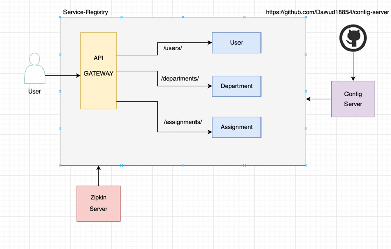

# Microservice-Project
##by Dawud Hussein

For my coding class I had to make a spring-boot microservices project

In this project I am implementing 3 functional services,
in my case USER-SERVICE communicates with the other 2 services.
Then I am implementing a service-registry and for all of them I am 
getting their configuration through a cloud-config-server.
Finally, there is an API-GATEWAY which handles all requests in which I
implemented a circuit-breaker


###Architecture:



##Zipkin
start zipkin server with docker:

```bash
docker run -d -p 9411:9411 openzipkin/zipkin
```

open in browser :

http://localhost:9411/zipkin/

Use Postman and refresh zipkin then see your services:


##Adding Monitoring through Prometheus
#Prometheus:
simply said prometheus takes actuator information
and makes our life easier by providing a nice GUI

configure prometheus.yml to:


start server and open at port 9090

example graph for memory consumption:


Now using Grafana (Benefits):

1. Much more customizable
2. Better insight on application health

Steps: 
1. Start Grafana server.exe
2. open on port 3000
3. login 
4. add datasource Prometheus


Nice Overview with Grafana Dashboard


import fully functional dashboard through json form https://Grafana/dashbords/12900

